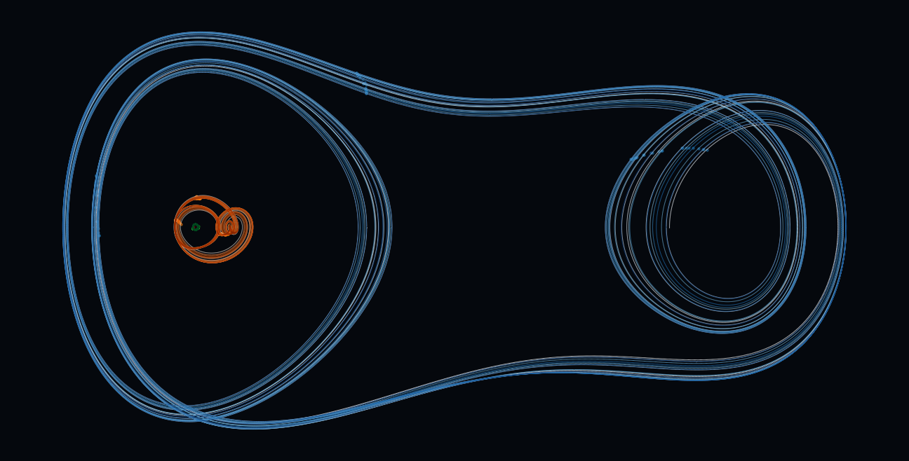

  

# Computational Physics, Dynamical Systems & Scientific ML

I work on problems at the intersection of **physics, scientific computing and machine learning**.

My current projects focus on **dynamical systems, inverse problems and data-driven methods for physical systems**, with a strong interest in numerical simulation, nonlinear dynamics and scientific image analysis.

---

## Current focus

- **Dynamical systems** and nonlinear physical models
- **Inverse problems** and deep learning for physical systems
- **Scientific ML benchmarks** and evaluation environments
- **Numerical simulation** and computational physics
- **Computer vision** and scientific image processing

---

## Featured projects

### 🌀 Hurricane Dorian Motion Analysis

  

Satellite-image analysis of Hurricane Dorian using MATLAB, combining **HSV segmentation, eye tracking, storm-area estimation, translational motion and RGB-based angular motion estimation**.

  <a href="https://github.com/rafav99/Dorian-Hurricane"><b>Explore the project →</b></a>

### 💥 Trinity Blast-Wave Analysis

  

Scientific image analysis of the Trinity explosion using **spatial calibration, segmentation, least-squares circle fitting and radial-intensity profiles** to recover the blast radius from historical photographs.

The measured radius-time relation is then compared with **Taylor-Sedov similarity scaling**, recovering an experimental power-law exponent close to the theoretical value of 2/5 and an energy estimate from the fitted expansion.

  <a href="https://github.com/rafav99/Trinity-Blast-Wave"><b>Explore the project →</b></a>

---

## Research directions

I am particularly interested in research and engineering problems where **physics, simulation and machine learning meet**.

Some directions I want to keep exploring include:

- nonlinear and chaotic systems
- inverse problems
- data-driven modelling of physical systems
- scientific deep learning
- electromagnetic and photonic simulation
- computational imaging
- control and dynamical-system identification
- simulation-based benchmark design

---

## Broader interests

- **Photonics** and electromagnetic modelling
- **Electronics** and physical systems
- **Space science** and aerospace applications
- **Scientific software** and simulation tools
- **Machine learning for physics**
- **Computer vision for scientific and engineering problems**

---

## Selected tools

  <code>Python</code>
  <code>MATLAB</code>
  <code>C</code>
  <code>C++</code>
  <code>Git</code>
  <code>Linux</code>

---

## In progress

I am continuing to expand this portfolio with projects in **scientific image processing, computational physics, nonlinear dynamics, inverse problems and machine learning for physical systems**.
